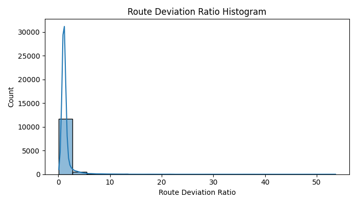

# Pipeline Analysis Report

**Run ID:** `20250516_162916`

**Compared to Run ID:** `20250516_154101`

## Summary Table
| Step                   | Before   | After   | Filtered   | % Filtered   | Cumulative % Retained   |
|------------------------|----------|---------|------------|--------------|-------------------------|
| cleaned_points         |          |         |            |              |                         |
| cleaned_with_period_id |          |         |            |              |                         |
| periods_with_sld_ratio |          |         |            |              |                         |
| network_outlier_flag   |          |         |            |              |                         |

## Indicator Overlaps
| Overlap                                               | Count                                                  |
|-------------------------------------------------------|--------------------------------------------------------|
| is_traj_outlier                                       | {'n_flagged': 4, 'flagged_pct': 0.032110459982339246}  |
| is_sld_outlier                                        | {'n_flagged': 17, 'flagged_pct': 0.1364694549249418}   |
| is_traj_outlier & is_sld_outlier                      | {'n_flagged': 0, 'flagged_pct': 0.0}                   |
| is_network_outlier                                    | {'n_flagged': 1603, 'flagged_pct': 12.868266837922453} |
| is_traj_outlier & is_network_outlier                  | {'n_flagged': 0, 'flagged_pct': 0.0}                   |
| is_sld_outlier & is_network_outlier                   | {'n_flagged': 13, 'flagged_pct': 0.10435899494260255}  |
| is_traj_outlier & is_sld_outlier & is_network_outlier | {'n_flagged': 0, 'flagged_pct': 0.0}                   |

### Route Deviation Ratio Histogram

### Network Shortest Distance Histogram

# Comparison to Previous Run

## Indicator Overlap Comparison
| Overlap                                               | 20250516_162916                                        | 20250516_154101                                        | Diff   |
|-------------------------------------------------------|--------------------------------------------------------|--------------------------------------------------------|--------|
| is_traj_outlier                                       | {'n_flagged': 4, 'flagged_pct': 0.032110459982339246}  | {'n_flagged': 4, 'flagged_pct': 0.032110459982339246}  | N/A    |
| is_traj_outlier & is_sld_outlier                      | {'n_flagged': 0, 'flagged_pct': 0.0}                   | {'n_flagged': 0, 'flagged_pct': 0.0}                   | N/A    |
| is_sld_outlier & is_network_outlier                   | {'n_flagged': 13, 'flagged_pct': 0.10435899494260255}  | {'n_flagged': 13, 'flagged_pct': 0.10435899494260255}  | N/A    |
| is_sld_outlier                                        | {'n_flagged': 17, 'flagged_pct': 0.1364694549249418}   | {'n_flagged': 17, 'flagged_pct': 0.1364694549249418}   | N/A    |
| is_traj_outlier & is_network_outlier                  | {'n_flagged': 0, 'flagged_pct': 0.0}                   | {'n_flagged': 0, 'flagged_pct': 0.0}                   | N/A    |
| is_network_outlier                                    | {'n_flagged': 1603, 'flagged_pct': 12.868266837922453} | {'n_flagged': 1603, 'flagged_pct': 12.868266837922453} | N/A    |
| is_traj_outlier & is_sld_outlier & is_network_outlier | {'n_flagged': 0, 'flagged_pct': 0.0}                   | {'n_flagged': 0, 'flagged_pct': 0.0}                   | N/A    |

