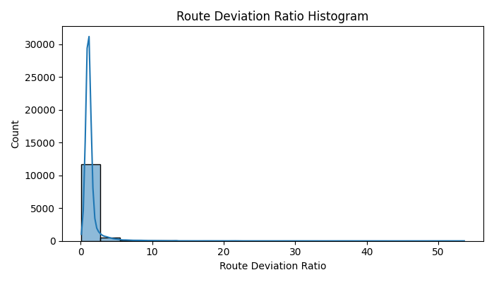

# Pipeline Analysis Report

**Run ID:** `20250516_175741`

**Compared to Run ID:** `20250516_154101`

## Summary Table
| Step                        |   Before |    After |   Filtered | % Filtered   | Cumulative % Retained   |
|-----------------------------|----------|----------|------------|--------------|-------------------------|
| base_cleaning               | 12667620 | 12667620 |          0 | 0.00%        | 100.00%                 |
| remove_temporal_gap_or_jump | 12667620 |  5378468 |    7289152 | 57.54%       | 42.46%                  |
| cleaned_points              |          |          |            |              |                         |
| min_period_points           |    33142 |    31861 |       1281 | 3.87%        | 0.25%                   |
| nan_sld_ratio               |    31861 |    25600 |       6261 | 19.65%       | 0.20%                   |
| cleaned_with_period_id      |          |          |            |              |                         |
| periods_with_sld_ratio      |          |          |            |              |                         |
| network_outlier_flag        |          |          |            |              |                         |

## Indicator Overlaps
| Overlap                                               | Count                                                  |
|-------------------------------------------------------|--------------------------------------------------------|
| is_traj_outlier                                       | {'n_flagged': 4, 'flagged_pct': 0.032110459982339246}  |
| is_sld_outlier                                        | {'n_flagged': 17, 'flagged_pct': 0.1364694549249418}   |
| is_traj_outlier & is_sld_outlier                      | {'n_flagged': 0, 'flagged_pct': 0.0}                   |
| is_network_outlier                                    | {'n_flagged': 1603, 'flagged_pct': 12.868266837922453} |
| is_traj_outlier & is_network_outlier                  | {'n_flagged': 0, 'flagged_pct': 0.0}                   |
| is_sld_outlier & is_network_outlier                   | {'n_flagged': 13, 'flagged_pct': 0.10435899494260255}  |
| is_traj_outlier & is_sld_outlier & is_network_outlier | {'n_flagged': 0, 'flagged_pct': 0.0}                   |

### Route Deviation Ratio Histogram

### Network Shortest Distance Histogram

# Comparison to Previous Run

## Indicator Overlap Comparison
| Overlap                                               | 20250516_175741                                        | 20250516_154101                                        | Diff   |
|-------------------------------------------------------|--------------------------------------------------------|--------------------------------------------------------|--------|
| is_traj_outlier & is_sld_outlier                      | {'n_flagged': 0, 'flagged_pct': 0.0}                   | {'n_flagged': 0, 'flagged_pct': 0.0}                   | N/A    |
| is_traj_outlier & is_network_outlier                  | {'n_flagged': 0, 'flagged_pct': 0.0}                   | {'n_flagged': 0, 'flagged_pct': 0.0}                   | N/A    |
| is_traj_outlier & is_sld_outlier & is_network_outlier | {'n_flagged': 0, 'flagged_pct': 0.0}                   | {'n_flagged': 0, 'flagged_pct': 0.0}                   | N/A    |
| is_traj_outlier                                       | {'n_flagged': 4, 'flagged_pct': 0.032110459982339246}  | {'n_flagged': 4, 'flagged_pct': 0.032110459982339246}  | N/A    |
| is_sld_outlier                                        | {'n_flagged': 17, 'flagged_pct': 0.1364694549249418}   | {'n_flagged': 17, 'flagged_pct': 0.1364694549249418}   | N/A    |
| is_network_outlier                                    | {'n_flagged': 1603, 'flagged_pct': 12.868266837922453} | {'n_flagged': 1603, 'flagged_pct': 12.868266837922453} | N/A    |
| is_sld_outlier & is_network_outlier                   | {'n_flagged': 13, 'flagged_pct': 0.10435899494260255}  | {'n_flagged': 13, 'flagged_pct': 0.10435899494260255}  | N/A    |

